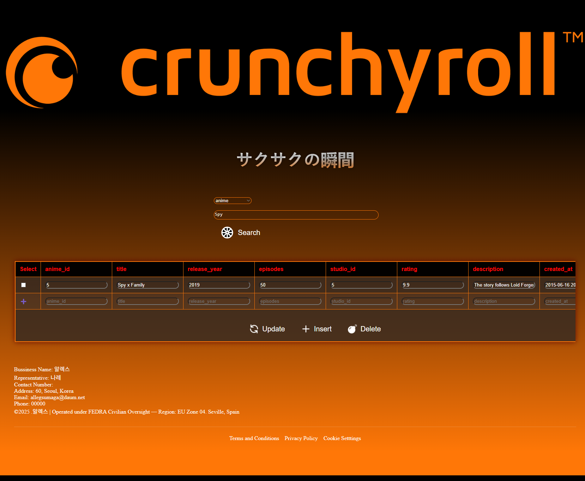

# PHP Page Design to Interact with a Database

The goal of this page is to provide a practical interface for interacting with a database using basic <strong>SQL</strong> operations.

| Features | Description |
| --- | --- |
| Search Bar | Search through your databases. |
| Insert | Insert new records in a table. |
| Update | Modify the existing records in a table. |
| Delete | Delete existing records in a table. |

The design takes inspiration from <strong>anime aesthetics</strong>, but it can easily be customized with CSS to match any desired style. 

## Design of the Page

| ⚠️  Version # | Description |
| --- | --- |
|  v.1  | Dark-Sunset (release) |

### How to connect - Apple

| Steps | Command | Shell  |
| :--- |:---| :---:|
| Install MySQL | brew install mysql | bin/zsh |
| Start MySQL | brew services start mysql | - |
| Check MySQL Status | brew services list | - | 
| Access to mysql | mysql - u root | - |

### MySQL CLI 

| Command | Decription |
| :--- | :--- |
| SELECT USER(), CURRENT_USER(); | Show Current User |
| CREATE USER 'allegsu'@'localhost' IDENTIFIED BY '8989'; | Create User  |
| GRANT ALL PRIVILEGES ON *.* TO 'allegsu'@'localhost' WITH GRANT OPTION; | Grant All Privileges |
| FLUSH PRIVILEGES | Apply changes to user permissions |

### Final step:  Dump your existing database or create a new database

### How to connect - Windows

| Steps | Commmand | Description |
| :--- | :--- | :---: |
| Download PHP | https://www.php.net/downloads.php | PHP - 8.4.8 |
| Create a folder | mkdir php-(version) in C:\ | Powershell CLI |
| Copy all files from a folder to C:\php-8.4.8 | Copy-Item "C:\Downloads\flowA\*" "C:\php-8.4.8" | Powershell |
| Open Environment Variables |  systemPropertiesAdvanced | Powershell - 7.5.1 | 
| Add to the path | C:\php-8.4.8 | - |
| Check the version | php --version | - | 
| Create php.ini | cd C:\php then copy php.ini-development php.ini | Copy php.in-development to php.ini |
| Edit php.ini & Find the line | ;extension=mysql | Remove the semicolon to enable: extension=mysqli |
| Check the ext folder | \php-8.4.8\ext\ | locate: php_mysqli.dll
| Verify extension_dir in php.ini | extension_dir = "ext" | Open with text editor |
| In the section: On windows: extension_dir = "" | extension_dir = "C:\php-8.4.8\ext" | Use the full path |
| Save & run | php --ini | Expected Ouput: Loaded Configuration File:         C:\php-8.4.8\php.ini |

### ⚠️ For MySQL Installation in windows just use 

> winget install mysql
>> This would install the command-line client and the server 
>>> Don't forget to add it to the path

### VS Code Extensions

- PHP Intelephense - Ben Mewburn
- PHP Server - brapifra

### Developer:

> 알렉스 - Allegsu